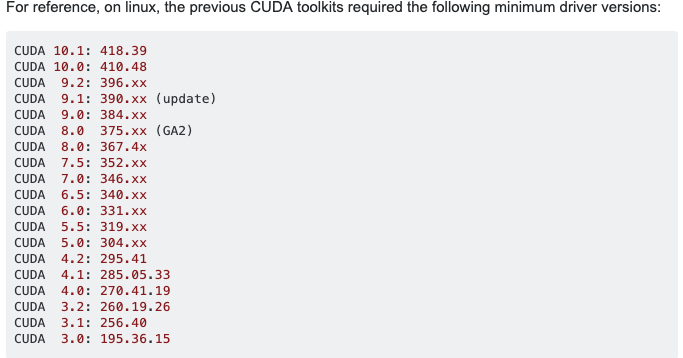

# GPU CheatSheet

List of frequently used GPU related commands

## Check if GPU is present
[StackOverflow](https://stackoverflow.com/questions/38559755/how-to-get-current-available-gpus-in-tensorflow)

```
import tensorflow as tf
tf.test.is_gpu_available()
# And/ or
tf.test.gpu_device_name()
```

```
from tensorflow.python.client import device_lib
device_lib.list_local_devices()
```


## nvidia-smi
[Details](https://www.andrey-melentyev.com/monitoring-gpus.html)

## GPU Memory allocation
Prevent TensorFlow to allocate all GPU memory
[StackOverflow](https://stackoverflow.com/questions/34199233/how-to-prevent-tensorflow-from-allocating-the-totality-of-a-gpu-memory)

## GPU Usage
Keep a watch on GPU Usage:\
`watch -d -n 1 nvidia-smi`
(-d: shows the changes between two refresh cycles)


## Conda env setup

Create new env:\
```conda 
conda create --name keras
conda activate keras
conda install keras-gpu
```

CUDA / Tensorflow compatibility versions:


Limit memory allocation:
```
import tensorflow as tf
from keras import backend as K

# Prevents tensorflow from pre-allocating the entire GPU memory
config = tf.ConfigProto()
config.gpu_options.allow_growth = True
K.tensorflow_backend.set_session(tf.Session(config=config))
```
